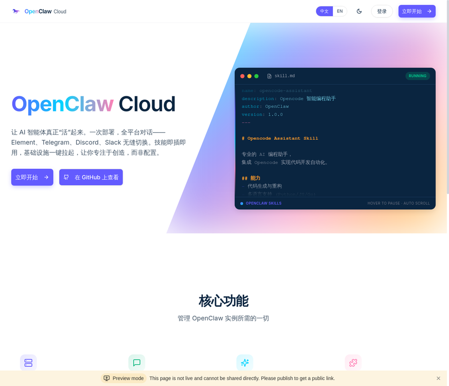
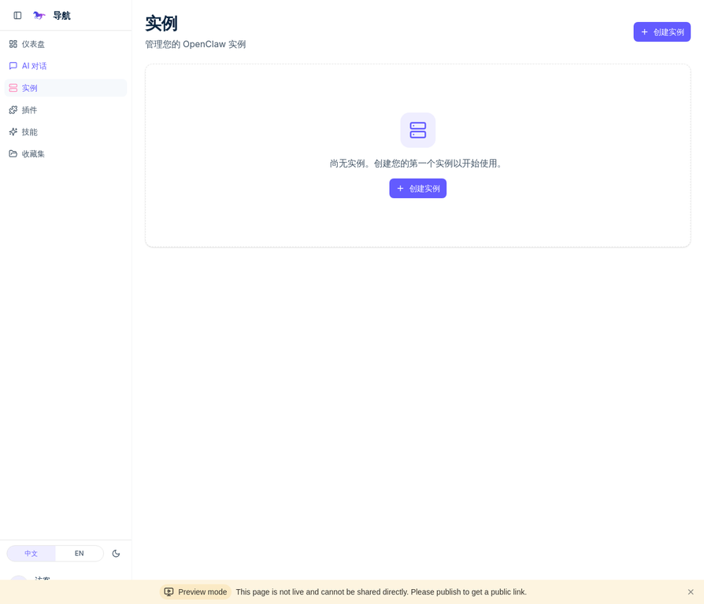
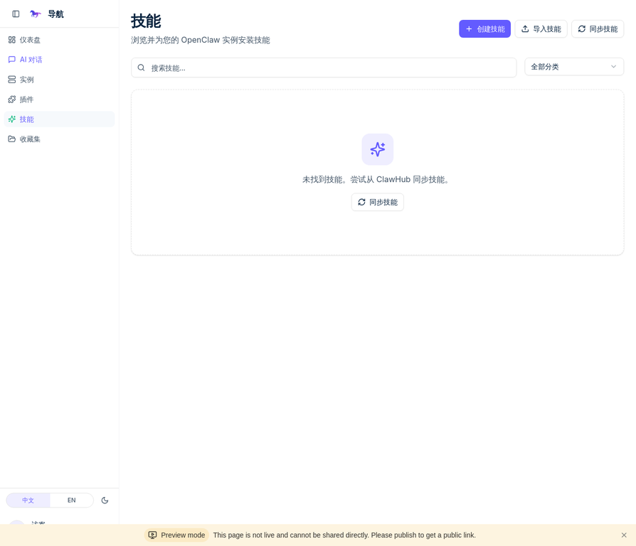
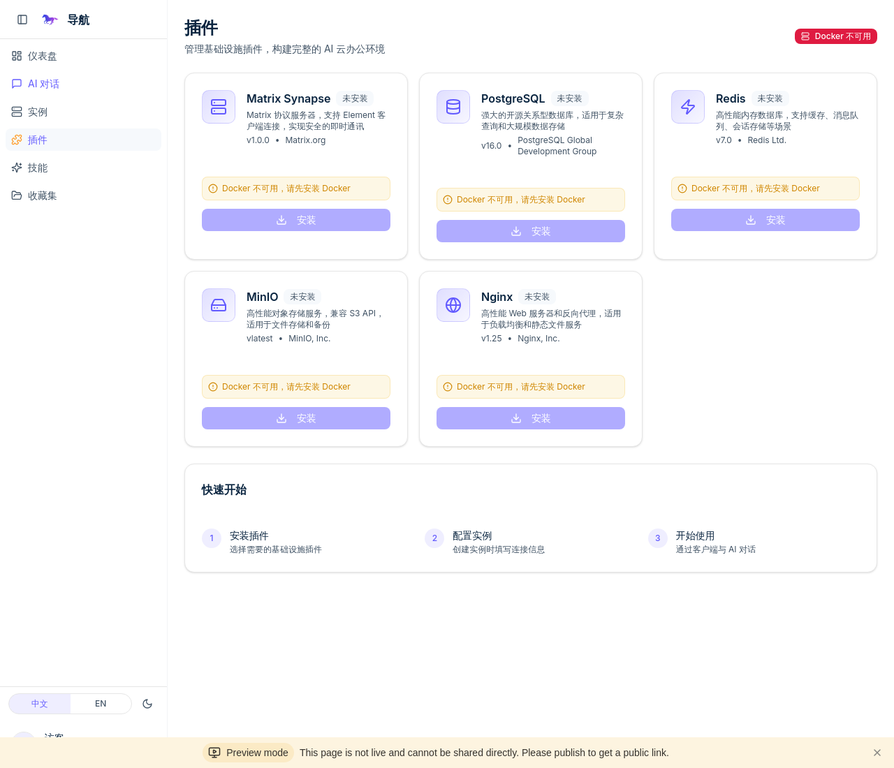
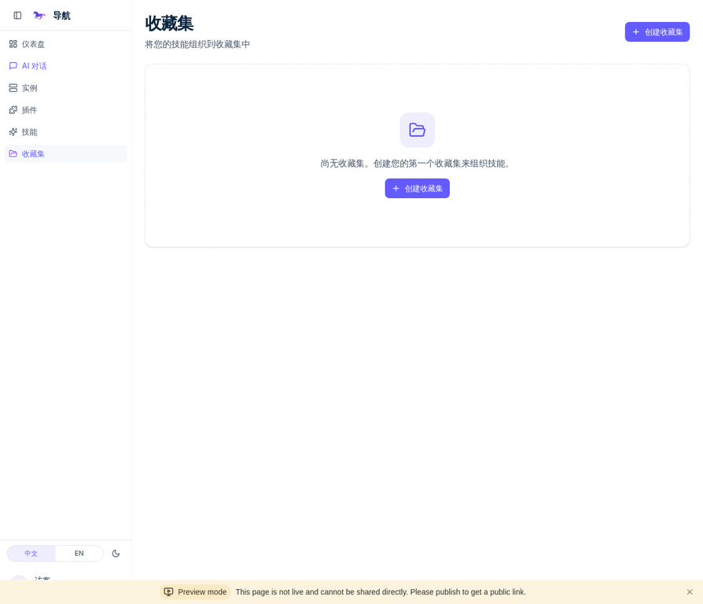
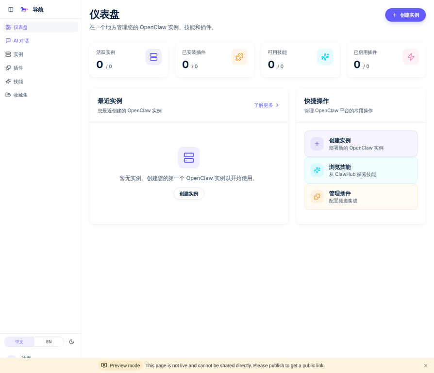
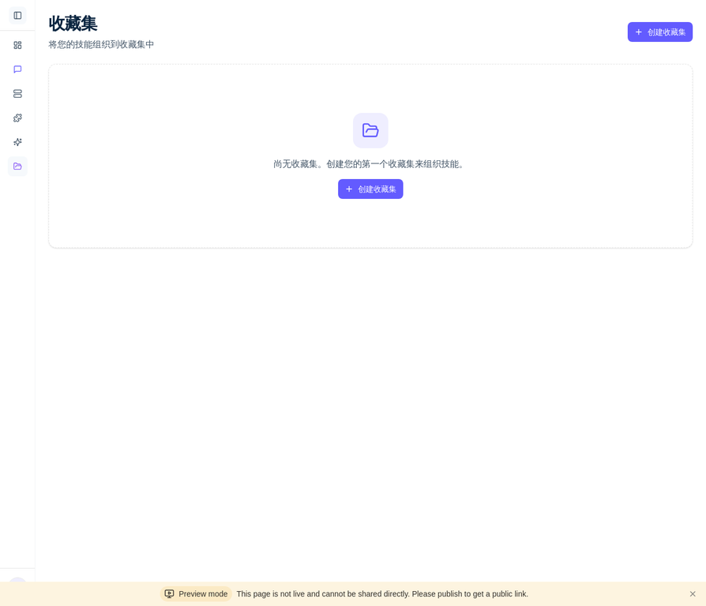

# OpenClaw Cloud 用户手册

欢迎来到 OpenClaw Cloud！本手册将带你一步步了解如何使用这个强大的 AI Agent 调度平台。

## 目录

- [1. 简介](#1-简介)
- [2. 快速入门](#2-快速入门)
  - [2.1 登录](#21-登录)
  - [2.2 仪表盘概览](#22-仪表盘概览)
- [3. 核心功能](#3-核心功能)
  - [3.1 实例管理](#31-实例管理)
  - [3.2 AI 对话](#32-ai-对话)
  - [3.3 技能管理](#33-技能管理)
  - [3.4 插件管理](#34-插件管理)
  - [3.5 收藏集](#35-收藏集)
- [4. 侧边栏导航](#4-侧边栏导航)
- [5. 获取帮助](#5-获取帮助)

## 1. 简介

OpenClaw Cloud 是一个为 AI Agent 生态设计的统一调度中枢。它允许你以云原生架构编排智能体集群，实现技能热插拔、多通道协同以及一键式基础设施部署，让你专注于创造，而非繁琐的配置。

## 2. 快速入门

### 2.1 登录

访问 OpenClaw Cloud 首页，点击右上角的“登录”按钮，通过 Manus OAuth 完成身份认证。

### 2.2 仪表盘概览

登录后，你将进入仪表盘页面。这里是你所有 Agent 活动的指挥中心，汇总了核心信息，并提供了快捷操作入口。

## 3. 核心功能

### 3.1 实例管理

“实例”是 OpenClaw Agent 的运行单元。在“实例”页面，你可以创建、配置、启动、停止和监控你的智能体实例。

- **创建实例**：点击“创建实例”按钮，填写实例名称、描述和配置，即可部署一个新的 Agent 实例。

### 3.2 AI 对话

“AI 对话”是与你的智能体实例进行实时交互的核心功能。在这里，你可以向 Agent 发出指令、提问或进行多轮对话。

- **选择实例**：从顶部的下拉菜单中选择一个正在运行的实例。
- **开始对话**：在输入框中输入你的问题或指令，然后按回车键发送。

### 3.3 技能管理

“技能”是扩展 Agent 能力的功能模块。你可以在“技能”页面浏览、搜索、安装和创建技能。

- **同步技能**：从 ClawHub 官方技能库同步最新的技能列表。
- **安装技能**：为你的实例安装所需技能，例如网页抓取、数据分析等。
- **创建技能**：你也可以创建自己的私有技能。

### 3.4 插件管理

“插件”用于集成外部服务和平台，例如消息通道（Telegram, Discord）、部署工具（Docker, K8s）等。

- **安装插件**：根据你的需求安装所需的基础设施插件。

### 3.5 收藏集

“收藏集”允许你将一组相关的技能打包管理，方便在不同实例之间快速部署。

- **创建收藏集**：将常用的技能组合成一个收藏集，例如“开发工具集”或“数据分析套件”。

## 4. 侧边栏导航

为了提供更灵活的界面空间，侧边栏支持展开和折叠两种状态。

- **展开状态**：显示完整的菜单项，包括图标和文字。
- **折叠状态**：只显示图标，节省屏幕空间，让你更专注于主内容区域。

| 展开状态 | 折叠状态 |
| :---: | :---: |
|  |  |

## 5. 获取帮助

如果你在使用过程中遇到任何问题，可以通过以下方式获取帮助：

- 阅读[部署文档](./deployment.md)
- 查看[API文档](./api.md)
- 在 [GitHub Issues](https://github.com/YOUR_USERNAME/openclaw-cloud/issues) 页面搜索或提交你的问题

感谢你的使用！
